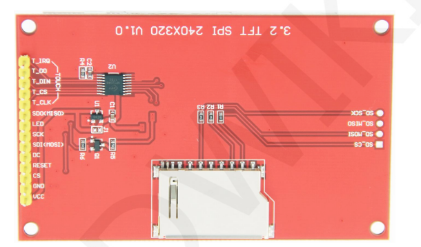
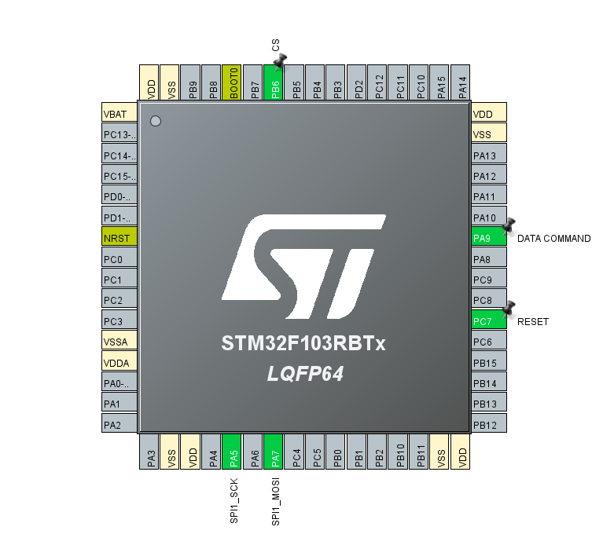
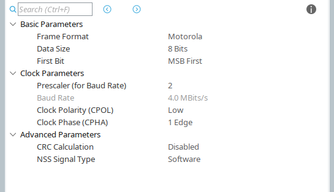
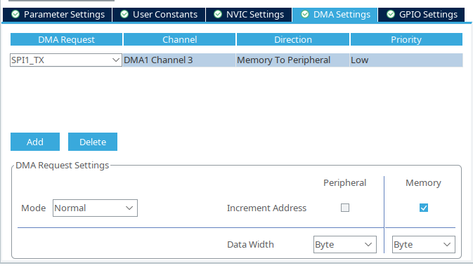

# ILI9341 SPI 3.2'' display with STM32F103RBT6



## Useful links  
### General
* [LCD wiki ILI9341](http://www.lcdwiki.com/3.2inch_SPI_Module_ILI9341_SKU:MSP3218)  
* [ILI9341 User Manual](http://www.lcdwiki.com/res/MSP3218/3.2inch_SPI_Module_MSP3218_User_Manual_EN.pdf)  
* [mbed ST-Nucleo](https://os.mbed.com/platforms/ST-Nucleo-F103RB/)
* [STM32 Nucleo-64 boards manual ČVUT](https://cw.fel.cvut.cz/b201/_media/courses/a8m37mam/documents/en.dm00105823.pdf)

### Library used
* [eziya/STM32_HAL_ILI9341](https://github.com/eziya/STM32_HAL_ILI9341)


### Other good libraries
* [ardnew/ILI9341-STM32-HAL](https://github.com/ardnew/ILI9341-STM32-HAL)
* [afiskon/stm32-ili9341](https://github.com/afiskon/stm32-ili9341)

## STM32CubeIDE Pinout and Configuration



### SPI clock configuration


### SPI DMA setup


### Connections
|Nucleo PIN|Display PIN|
|---|---|
|3V3|VCC|
|GND|GND|
|PB6 CS|CS|
|PC7|RESET|
|PA9|DC/RS|
|PA7 SPI1_MOSI|SDI (MOSI)|
|PA5 SPI1_SCK|SCK|
|3V3|LED|
|PA6 SPI1_MISO|SDO (MISO)|

### Code
#### ILI9341_STM32_Driver.h

```c
...
/* PIN Configuration */
#define HSPI_INSTANCE			&hspi1
#define LCD_CS_PORT				GPIOB
#define LCD_CS_PIN				GPIO_PIN_6
#define LCD_DC_PORT				GPIOA
#define LCD_DC_PIN				GPIO_PIN_9
#define	LCD_RST_PORT			GPIOC
#define	LCD_RST_PIN				GPIO_PIN_7
...

```
#### main.c
```c
int main(void)
{
	/* USER CODE BEGIN 1 */

	/* USER CODE END 1 */

	/* MCU Configuration--------------------------------------------------------*/

	/* Reset of all peripherals, Initializes the Flash interface and the Systick. */
	HAL_Init();

	/* USER CODE BEGIN Init */

	/* USER CODE END Init */

	/* Configure the system clock */
	SystemClock_Config();

	/* USER CODE BEGIN SysInit */

	/* USER CODE END SysInit */

	/* Initialize all configured peripherals */
	MX_GPIO_Init();
	MX_DMA_Init();
	MX_SPI1_Init();
	/* USER CODE BEGIN 2 */
	ILI9341_Init();
	ILI9341_SetRotation(SCREEN_HORIZONTAL_1);

	ILI9341_FillScreen(WHITE);
	HAL_Delay(500);
	ILI9341_DrawFilledCircle(160, 120, 50, BLACK);
	ILI9341_DrawText("START", FONT4, 130, 110, WHITE, BLACK);
	/* USER CODE END 2 */

	/* Infinite loop */
	/* USER CODE BEGIN WHILE */
	while (1)
	{
		/* USER CODE END WHILE */

		/* USER CODE BEGIN 3 */
	}
	/* USER CODE END 3 */
}
```

## Nucleo STM32F103RBT6 Pinout


